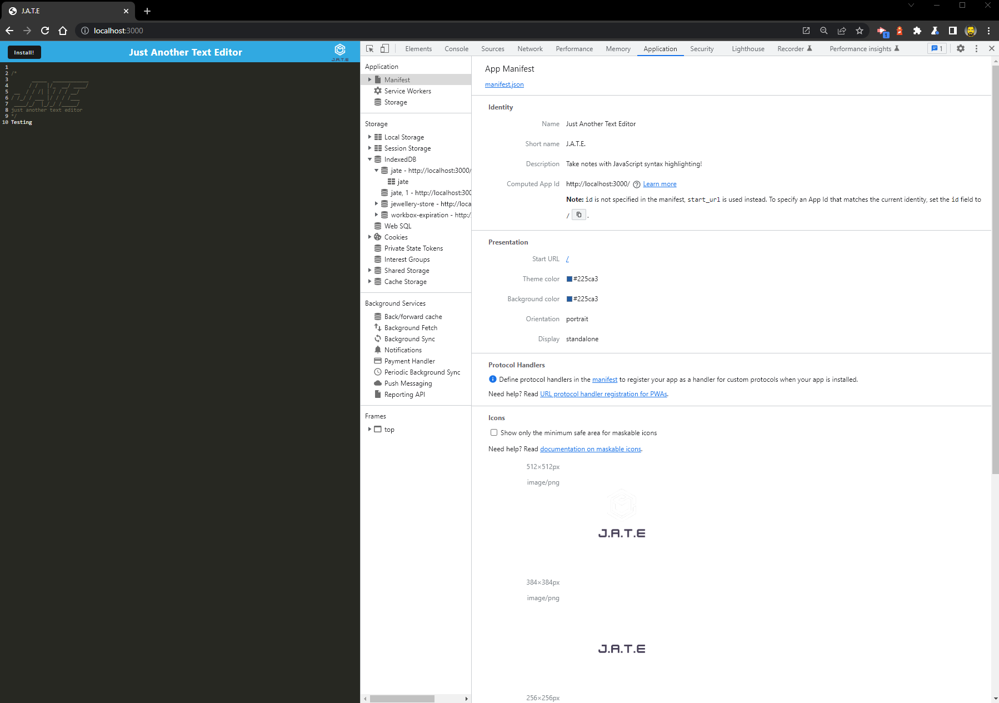
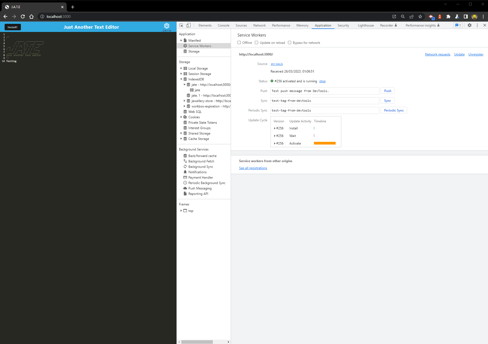

# Text Editor

## Table of Contents

- [Description](#description)
- [Acceptance Criteria](acceptance-criteria)
- [Installation](#installation)
- [Screenshots](#screenshots)
- [Technologies used](#technologies-used)
- [Deployed Link](#deployed-link)
- [License](#license)
- [Signature](#signature)

## Description

JATE is a text editor that runs in the browser. Its a single page application that meets the PWA criteria. It could be useful for developers to create notes or code snippets with or without internet connection so that they could reliably retrieve them for later use.

## User Story

```md
AS A developer
I WANT to create notes or code snippets with or without an internet connection
SO THAT I can reliably retrieve them for later use
```

## Acceptance Criteria

```md
GIVEN a text editor web application
WHEN I open my application in my editor
THEN I should see a client server folder structure
WHEN I run `npm run start` from the root directory
THEN I find that my application should start up the backend and serve the client
WHEN I run the text editor application from my terminal
THEN I find that my JavaScript files have been bundled using webpack
WHEN I run my webpack plugins
THEN I find that I have a generated HTML file, service worker, and a manifest file
WHEN I use next-gen JavaScript in my application
THEN I find that the text editor still functions in the browser without errors
WHEN I open the text editor
THEN I find that IndexedDB has immediately created a database storage
WHEN I enter content and subsequently click off of the DOM window
THEN I find that the content in the text editor has been saved with IndexedDB
WHEN I reopen the text editor after closing it
THEN I find that the content in the text editor has been retrieved from our IndexedDB
WHEN I click on the Install button
THEN I download my web application as an icon on my desktop
WHEN I load my web application
THEN I should have a registered service worker using workbox
WHEN I register a service worker
THEN I should have my static assets pre cached upon loading along with subsequent pages and static assets
WHEN I deploy to Heroku
THEN I should have proper build scripts for a webpack application
```

## Installation

This program can be run through a browser using the link to the the deployed application. Alternatively, to run this application locally you will need to:

- Clone this repository to receive all of the files.

- Run "npm install" in the command line of your terminal to set up all of the dependencies.

- Run "npm start" to start the backend and serve the client.

- Go to the url of the application (http//:localhost:3001) to begin using it.

## Screenshots

## Mock-Up

The following animation demonstrates the application functionality:


The following image shows the application's `manifest.json` file:



The following image shows the application's registered service worker:



The following image shows the application's IndexedDB storage:


## Technologies used

Node.js, Express.js, IndexedDB, PWA, Heroku

## Deployed Link

[Live Site](https://damp-hollows-29575.herokuapp.com/)

## License


## Signature

GitHub: [NebsterOne](https://github.com/NebsterOne)
